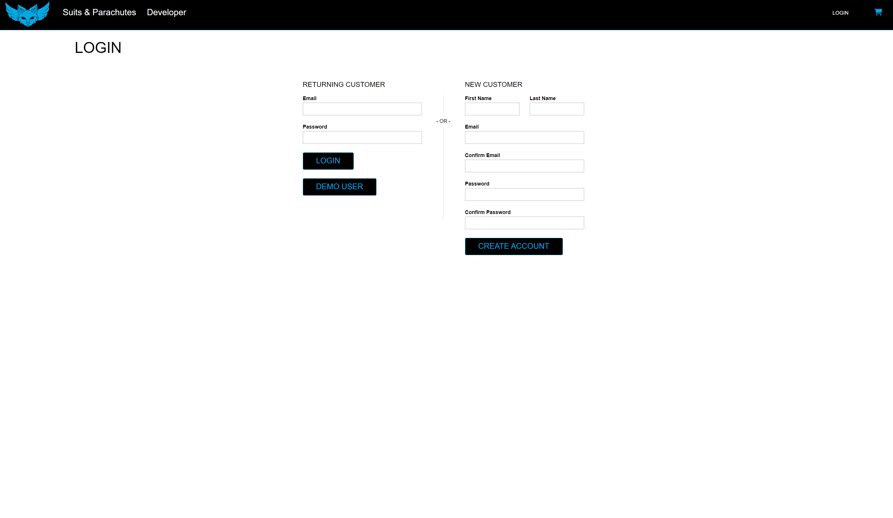
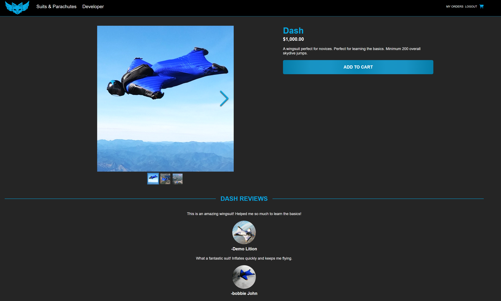
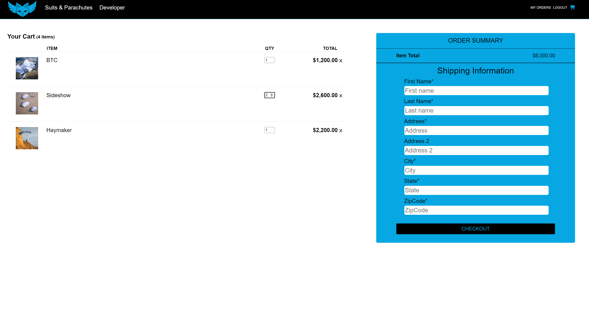
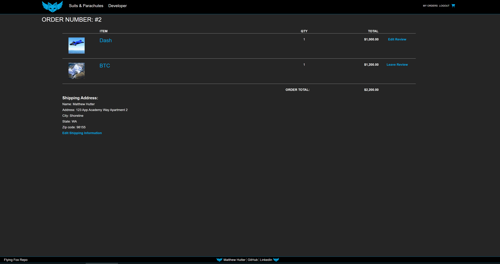

# Flying Fox

## Welcome to Flying Fox, a clone of [Squirrel](https://squirrel.ws/)

## View the live site here: [Flying Fox](https://flying-fox-capstone.onrender.com/)

Flying Fox jumps into human flight, providing a place to look at and purchase wingsuits, tracking suits, and parachutes for skydiving and BASE jumping. This project is based off of the Squirrel website where they sell similar items and other equipment.

## Technologies and Frameworks used:
- Javascript
- Python
- SQLAlchemy
- React
- Redux
- CSS
- HTML 5
- Git
- Hosted on Render with a Postgres database

## MVP Core Features:
- Local storage shopping cart
- Purchases/ Orders
- Reviews with AWS implementation

## Screenshots:
Home Page


Login and Signup


Item page


Cart


Order Page


## Future Implementation Goals:

- Categories
- Articles/ News feature

## Getting Started

1. Clone this repository.

```bash
git clone https://github.com/Sparky338/FlyingFox-Capstone.git
```

2. Install dependencies

```bash
pipenv install -r requirements.txt
```

3. Create a **.env** file based on the example with proper settings for your
   development environment

4. Make sure the SQLite3 database connection URL is in the **.env** file

5. Get into your pipenv, migrate your database, seed your database, and run your Flask app

   ```bash
   pipenv shell
   ```

   ```bash
   flask db upgrade
   ```

   ```bash
   flask seed all
   ```

   ```bash
   flask run
   ```

6. To run the React App in development, in a new terminal, get into react-app and start it

   ```bash
   cd react-app
   ```

   ```bash
   npm start
   ```
